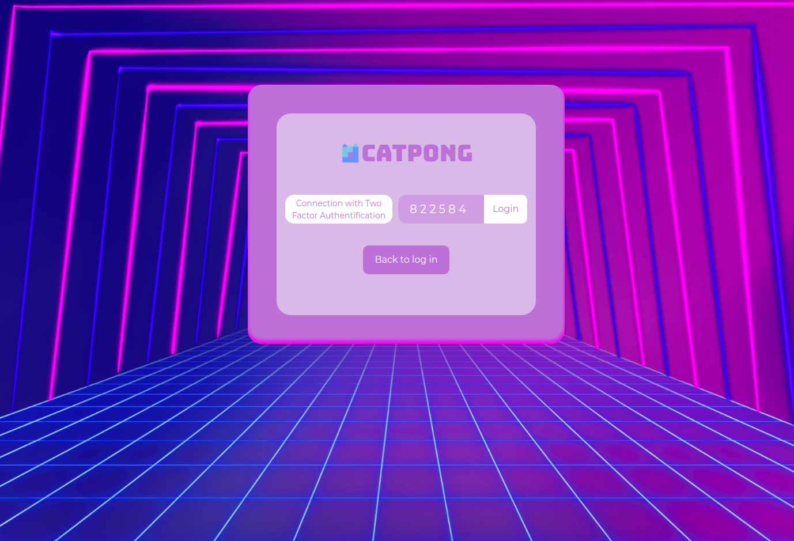
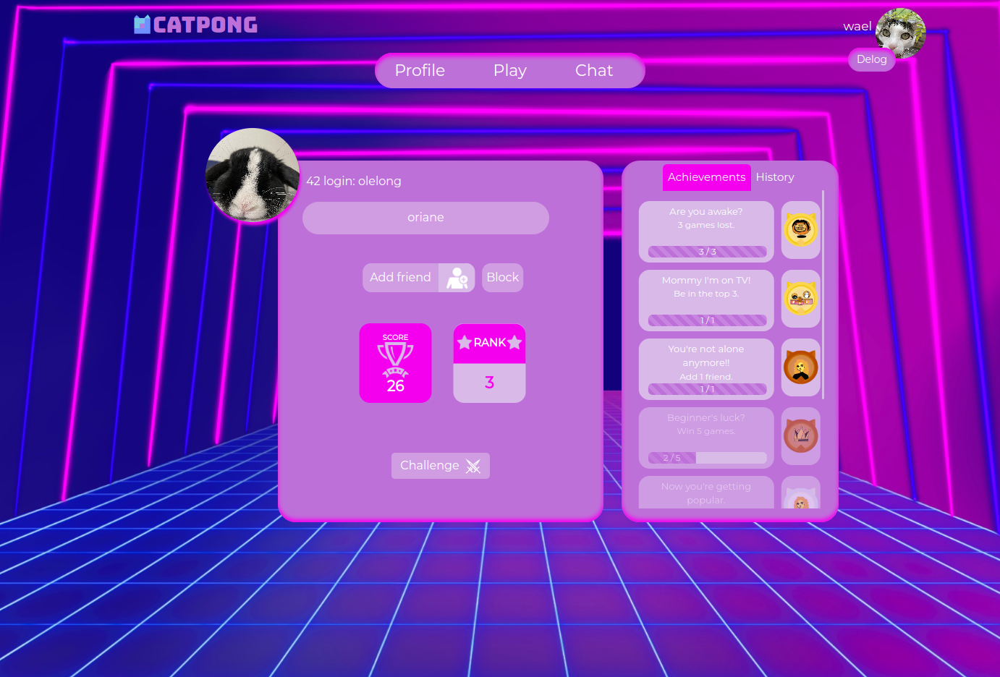
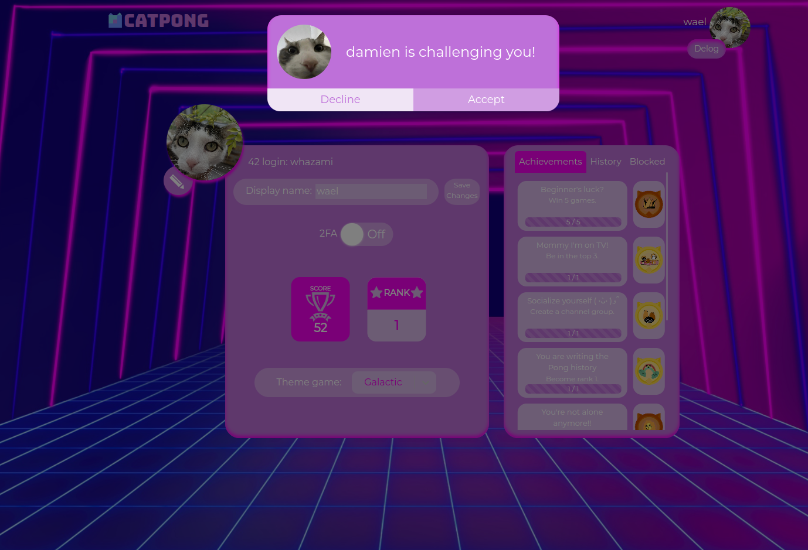
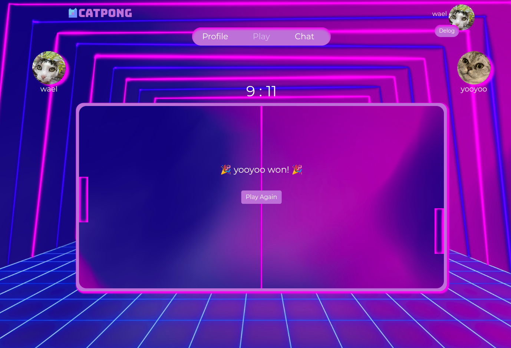
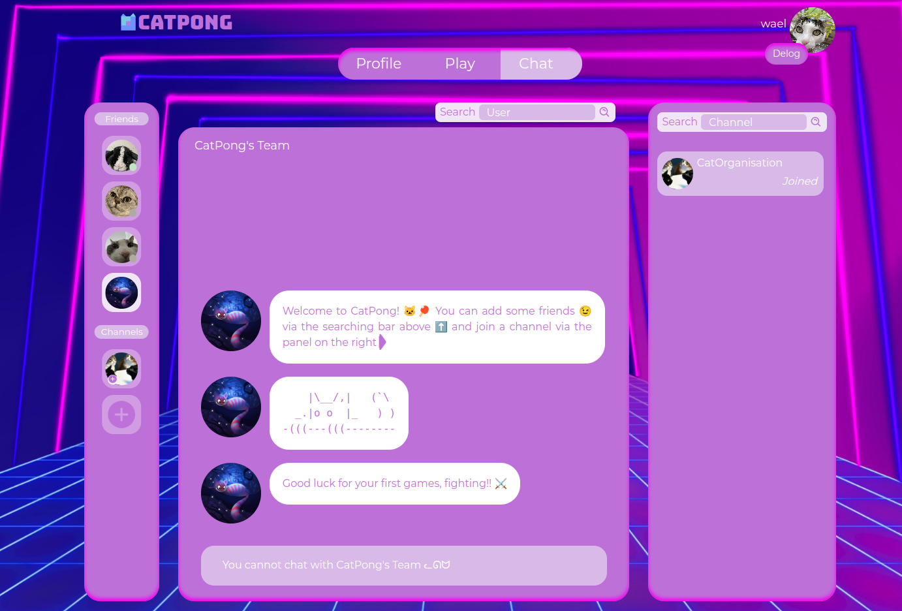
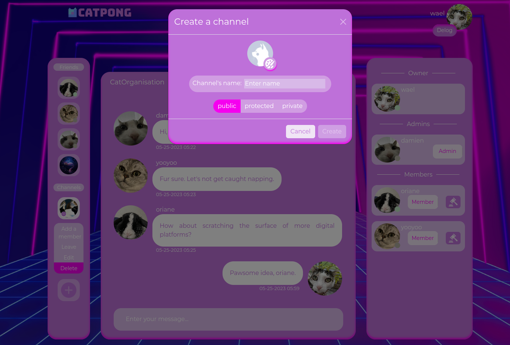

# CatPong

## Overview

This repository represents the implementation of ft_transcendence, a project developed as part of the curriculum at 42 Paris. The aim of this project is to create a web-based version of the game "Pong" that enables users to play against each other and interact in a variety of ways.

The code is not provided as it's the rule of 42Seoul.

You can access the website [here](https://cat-pong.com).

  <video src="https://github.com/whazami/catpong/assets/44798789/a6280602-d39c-494f-b27d-b5e8534611bc">
    Your browser does not support videos but you can watch the CatPong's Demo <a href="https://dl.dropboxusercontent.com/scl/fi/hqb4n7u13gp8scrpk2c5r/CatPongDemo.mp4?rlkey=skj7ahit0n518807r1zev9r8o&dl=0">here</a>.
  </video>

If the video above does not load, click [here](https://github.com/CatOrganisation/ft_transcendence/assets/44798789/97374f49-9969-45f1-be89-edbb4ba9410c).

## Features

* Real-time multiplayer gameplay with WebSocket communication
* Ability to rejoin the current game if connection lost or when navigating to another page
* User account creation and authentication system (including 2FA)
* Player ranking and leaderboard
* Real-time users' status, allowing observation of their game if they are currently playing or challenging them if they are available
* User profiles with statistics, achievements, game theme and history
* Manage friendships and blocked users
* Chat functionality (including DMs and Channels) for users to communicate
* Channels types: public, protected (join by password), private (join by invitation)
* Channels roles: owner (can sanction and manage roles), admin (can sanction), member
* Channels sanctions: mute, kick, ban
* Responsive and user-friendly interface design

## Screenshots

  
   

 

  
   

 

  
   

## Documentation

Note that you can test the endpoints of the API [here](https://api.cat-pong.com) which will directly affect the [deployed](https://cat-pong.com) version. For more information on interacting with the API, please refer to the [endpoint.md](endpoint.md) and [socket.md](socket.md) files.

## Troubleshooting

Currently, the image upload functionality is not working on the [deployed](https://cat-pong.com) version due to the absence of a cloud storage service, like Google Cloud Storage or Amazon S3. If you find something else not working, don't hesitate to open an issue.
